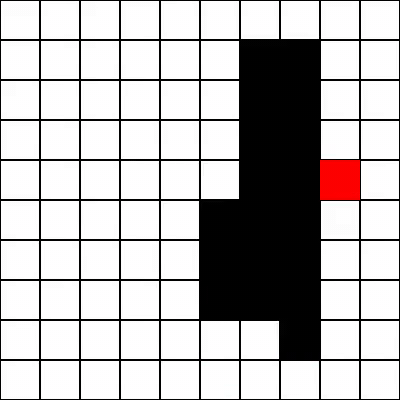

<div align="center">

# Snake AI

**A reinforcement learning agent that learns to play Snake from scratch**




*PPO agent gliding through the grid after 5M training steps — [full video](videos/best-model-ppo-snake-v0-step-0-to-step-1000.mp4)*

</div>

## How it works

- **Custom environment** — a 10×10 Snake game built with pygame, exposed as a standard [Gymnasium](https://gymnasium.farama.org/) env (`game.py`)
- **Relative controls** — the agent picks *turn left / go straight / turn right*, so it has to learn spatial awareness instead of memorizing absolute moves
- **Reward shaping** — `+10` per apple, `−10` for hitting a wall or itself, and a small step penalty to keep it efficient
- **Two ways to see** — a compact 8-value vector (head position, direction, apple distance, adjacent dangers) or a 3-channel board image processed by a small CNN (`cnn_features.py`)
- **Training** — PPO (default) or DQN via [RL Zoo3](https://github.com/DLR-RM/rl-baselines3-zoo) / Stable Baselines3, across 16 parallel environments for 5M timesteps

## Quick start

```bash
uv sync                      # install dependencies (Python 3.13)

uv run train.py              # train PPO on snake-v0  (→ logs/)
uv run train.py --algo dqn   # ...or train DQN instead

uv run enjoy.py              # watch the latest trained agent play

uv run record.py --env snake-v0 -f logs -n 1000 -o videos   # record a demo video

uv run tensorboard --logdir logs/tb   # training curves
```

## Project structure

```
game.py           # Snake Gymnasium environment (vector + image observations)
cnn_features.py   # CNN feature extractor for image observations
train.py          # Training entry point (RL Zoo3 wrapper)
enjoy.py          # Load a trained agent and watch it play
record.py         # Record gameplay videos
hyperparams/      # PPO & DQN hyperparameters
videos/           # Recorded demos
```
